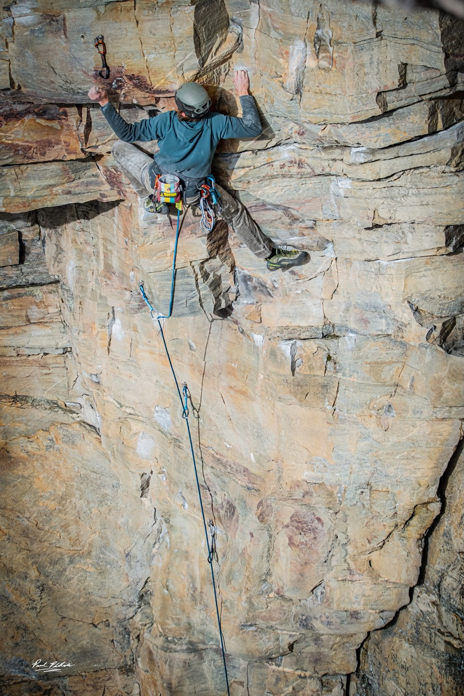

# About Me 

Outside of teaching and research, I am an outdoor enthusiast, amateur ethicist, and classics (from trucks to novels) afficionado.  The majority of my spare time is spent roaming the mountains, whether that be by climbing, running, or backpacking.  Below you can find me pulling hard on the crux of *Devil in the White House*, a classic route at Pilot Mountain State Park, and summitting Mount Ida along the continental divide in Rocky Mountain National Park.  

My love for ethics grew very serendipitously out of my freshman year at Clemson.  An admittedly arbitrarily chosen gen-ed requirement (Introduction to Ethics) led to a three-year stint on the Clemson intercollegiate ethics bowl team.  This was one of my first opportunity to be regularly and vigorously intellectually challenged, and to have to defend my own positions against objection.  Beyond being a useful academic tool, this team helped expand my world view and allow me to extensively travel (we were lucky enough to qualify for the national competition all three years) for the first time.  

The experience was formative enough that when I came to graduate school at UNC, I promised myself I would find a way to be involved in the team here.  In my first two years, I occasionally volunteered as a guest judge for both the high school and college teams.  However, going into my fourth year, I was asked to coach the UNC team.  You can find more about these experience on the ethics page, but suffice it to say, this has been and will continue to be an integral part of my life.  

[Back to Homepage](index.md)
