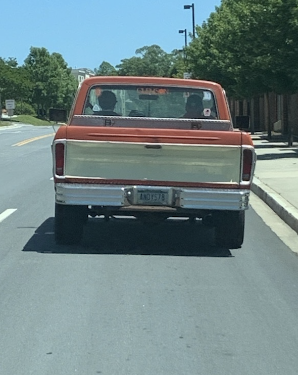

# About Me 

Outside of teaching and research, I am an outdoor enthusiast, amateur ethicist, and classics (from trucks to novels) afficionado. The majority of my spare time is spent roaming the mountains, whether that be by climbing, running, or backpacking. Below you can find me pulling hard on the crux of *Devil in the White House*, a classic route at Pilot Mountain State Park, and summiting Mount Ida along the continental divide in Rocky Mountain National Park.  

<!-- Resize and wrap text around images -->

  
  My love for ethics grew very serendipitously out of my freshman year at Clemson. An admittedly arbitrarily chosen gen-ed requirement (Introduction to Ethics) led to a three-year stint on the Clemson intercollegiate ethics bowl team. This was one of my first opportunities to be regularly and vigorously intellectually challenged, and to have to defend my own positions against objection. Beyond being a useful academic tool, this team helped expand my world view and allow me to extensively travel (we were lucky enough to qualify for the national competition all three years) for the first time. The experience was formative enough that when I came to graduate school, I promised myself I would find a way to be involved in the team here. In my first two years, I occasionally volunteered as a guest judge for both the high school and college teams. However, going into my fourth year, I was asked to coach the UNC team. You can find more about these experiences on the ethics page, but suffice it to say, this has been and will continue to be an integral part of my life.

  
  When a research problem has me stuck and a climbing project has me stymied, I will often turn to tinkering with my 1978 f100. She has been given the name Peachy, as a childhood friend described her paint job as nothing less. As an automatic in an era of 3-speed manual transmissions, she is a bit of an enigma. In any case, the classic trucks like Peachy boast so much extra space under the hood, that even a novice like myself can manage most repairs.

  
  Finally, I am (not so recently) engaged to the person on the other end of the rope. Jennica is a fifth year PhD student in Chemistry at UNC and also my climbing, hiking, and life partner. We plan to get married in (where else?) Colorado in the summer of 2025.

  
  [Back to Homepage](index.md)

<!-- Clear floats to prevent content below from floating around images -->

