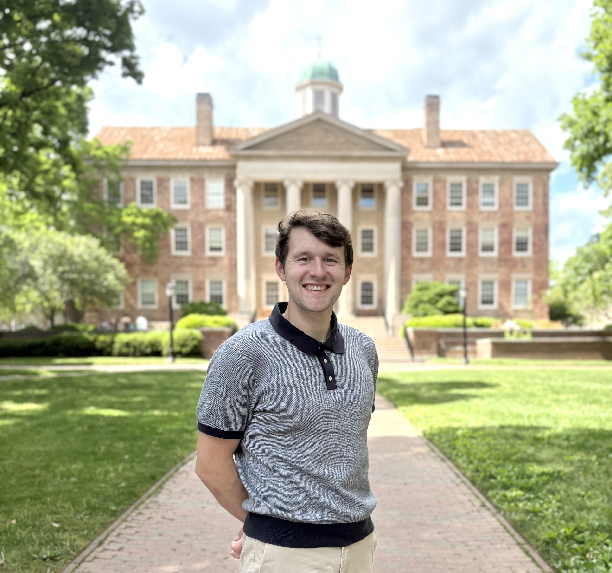

Assistant Professor   
Department of Mathematics, Lafayette College    
atackermat@lafayette.edu

# Welcome
I am an Assistant Professor of Mathematics at Lafayette College.  I earned my Ph.D. in Statistics and Operations Research at UNC Chapel Hill, under the direction of [Dr. Zhengwu Zhang](https://zhengwu.github.io/), [Dr. Jan Hannig](https://hannig.cloudapps.unc.edu/) and [Dr. Steve Marron](https://marron.web.unc.edu/).  My focus is primarily on high dimensional inference and data integration, algorithmic bias, and interpretable machine learning.  Prior to coming to UNC, I obtained my undergraduate degree in Mathematical Sciences from Clemson University in 2020.  I am also deeply involved with high school and intercollegiate ethics bowl and was the coach of the 2023-2024 UNC intercollegiate ethics bowl team. 

- [Teaching](teaching.md)
- [Research](research.md)
- [Ethics Bowl](ethicsbowl.md)
- [About Me](about.md)
- [CV](CV.md)
  

